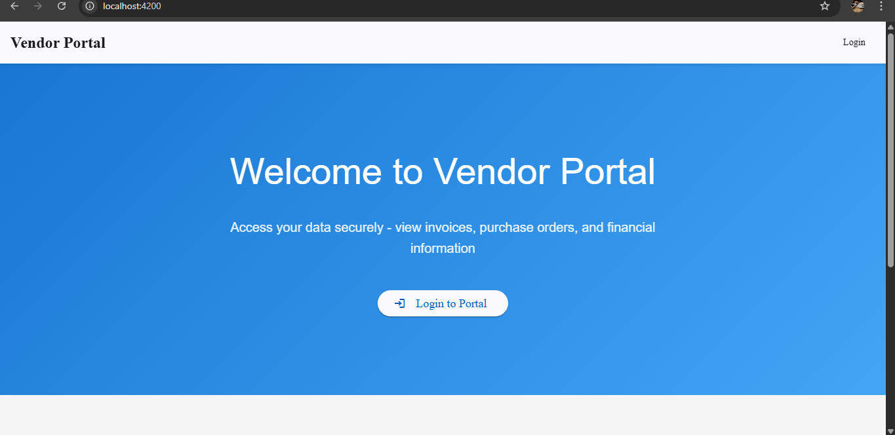
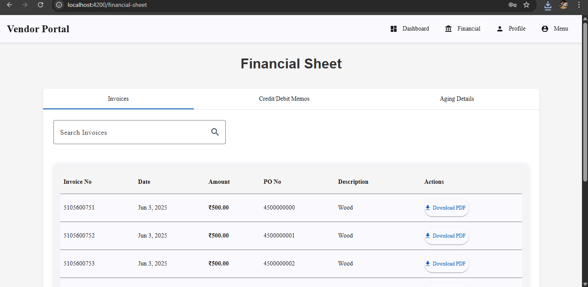

# Vendor Portal (MM + FI)

A portal for vendors to view and manage their transactions with the company – RFQs, purchase orders, goods receipts – along with financial details like invoices, payments, and credit/debit memos.

## UI Frontend

